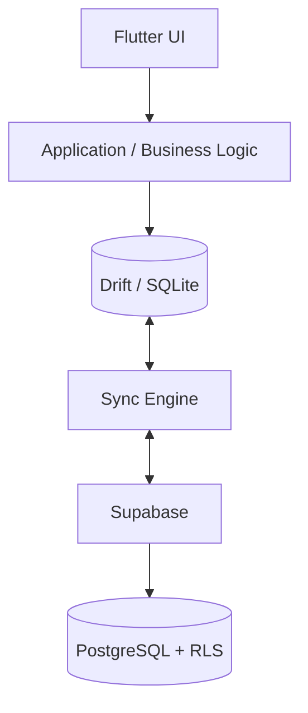

# Stocki — Offline-First Business Management Platform 🇹🇳

> A cross-platform business management and POS application designed for Tunisian hardware stores, with offline-first inventory, sales, customer credit, invoicing, analytics, and cloud synchronization.

**Stocki** is built around a real-world constraint: a point-of-sale system must remain usable when the internet is unreliable. The application therefore treats the local database as a first-class part of the system and synchronizes changes with Supabase when connectivity is available.

## Why this project?

Traditional small-business software often assumes a permanent internet connection. Stocki explores a different architecture:

- transactions are written locally first;
- the application remains usable offline;
- changes are queued and synchronized with the cloud;
- PostgreSQL Row Level Security isolates store data;
- role-based permissions control sensitive operations;
- inventory is derived from stock movements rather than a single mutable quantity.

This makes the project both a practical product prototype and a software-engineering case study.

## Key capabilities

- 🔐 **Authentication & RBAC** — owner, manager, cashier, stock manager, and employee permissions.
- ⚡ **Offline-first operation** — local SQLite database powered by Drift.
- 🔄 **Bidirectional synchronization** — local ↔ Supabase sync with retry handling and device-aware synchronization records.
- 📦 **Inventory management** — products, variants, units, conversions, stock movements, low-stock and out-of-stock tracking.
- 🛒 **POS & checkout** — atomic cart checkout and payment tracking.
- 🚚 **Purchasing & suppliers** — supplier records, purchases, purchase items, and stock entry workflows.
- 👥 **Customers & credit** — customer accounts, outstanding balances, debt payments, and purchase history.
- 🧾 **Invoicing** — invoice numbering and PDF output for thermal 80mm receipts and A4 invoices.
- 📊 **Business analytics** — revenue, transaction counts, payment-method breakdowns, top-selling products, inventory valuation, and debt exposure.
- 🖥️ **Desktop support** — Windows-oriented shell and keyboard-first POS workflows alongside the mobile application.
- 📝 **Auditability** — activity and synchronization logs for operational traceability.

## Architecture



### Architectural principles

**Local-first writes**

Business operations are designed around the local database so the application can continue working without network access.

**Transactional consistency**

Operations such as checkout are treated as atomic business transactions so related records remain consistent.

**Event-driven inventory**

Stock is derived from movements such as purchases, sales, adjustments, and returns rather than relying only on a manually edited stock field.

**Cloud synchronization**

The synchronization layer moves local changes to Supabase and pulls remote changes back to the device, with synchronization metadata available for troubleshooting and traceability.

**Database-level isolation**

Supabase/PostgreSQL Row Level Security is used as an additional boundary for multi-store data access.

## Tech stack

| Layer | Technology |
|---|---|
| Client | Flutter / Dart |
| Local database | SQLite + Drift |
| Cloud backend | Supabase |
| Database | PostgreSQL |
| Authentication | Supabase Auth |
| Authorization | Application RBAC + PostgreSQL RLS |
| Documents | PDF generation |
| Platforms | Android + Windows |

## Engineering highlights

This project focuses on problems that appear in production business software rather than only UI implementation:

- designing an offline-first data model;
- keeping local transactions consistent;
- synchronizing local and remote state;
- protecting tenant/store boundaries;
- implementing role-based access control;
- handling invoice numbering;
- modeling units and product variants;
- maintaining an auditable stock-movement history;
- supporting both mobile and desktop workflows.

## Project structure

```text
lib/
├── core/              # authentication, permissions, navigation and shared infrastructure
├── features/          # inventory, sales, cart, customers, suppliers, reports, etc.
├── services/          # sync, PDF receipts and other application services
└── ...

supabase/
└── ...                # database migrations and backend configuration

docs/
├── ARCHITECTURE.md
├── DATABASE.md
├── DEPLOYMENT.md
└── USER_GUIDE.md
```

## Getting started

### Requirements

- Flutter SDK
- Dart SDK compatible with the project's Flutter version
- Android Studio for Android development
- Visual Studio with Windows desktop development tools for Windows builds
- A Supabase project for cloud-backed functionality

### Installation

```bash
git clone https://github.com/Mossaabjelliti/Stocki.git
cd Stocki

flutter pub get
dart run build_runner build --delete-conflicting-outputs
flutter run
```

For platform-specific configuration and deployment details, see the project documentation.

## Documentation

- [Architecture](ARCHITECTURE.md) — application architecture and synchronization design
- [Database](DATABASE.md) — local/remote data model and database design
- [Deployment](DEPLOYMENT.md) — deployment and platform setup
- [User Guide](USER_GUIDE.md) — application workflows

## Current status

Stocki is an actively developed portfolio/product project. Core business flows are implemented, while some production-hardening areas continue to evolve, particularly around synchronization reliability, platform packaging, and long-term subscription/licensing workflows.

The README intentionally describes implemented architecture and capabilities without presenting the project as a finished commercial SaaS product.

## Roadmap

- [ ] Strengthen automated unit/integration coverage
- [ ] Complete sync conflict-resolution strategy
- [ ] Continue Windows release hardening
- [ ] Improve observability around sync failures
- [ ] Complete subscription/licensing workflow
- [ ] Expand automated CI checks

## Author

**Mossaab Jelliti**

Software engineering, data, and AI projects focused on building practical systems for the Tunisian and MENA market.

- GitHub: [@Mossaabjelliti](https://github.com/Mossaabjelliti)
